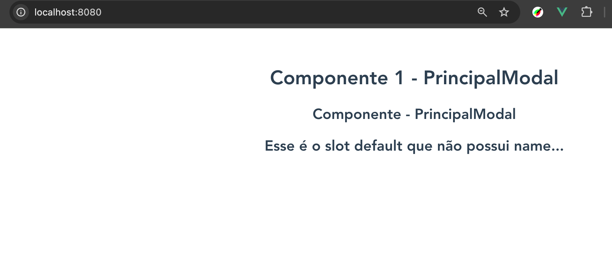

# Slots no Vue.js

## Sobre
Slots no Vue.js permitem que um componente receba conteúdo dinâmico de seu componente pai, possibilitando maior flexibilidade na composição de componentes reutilizáveis. Eles são úteis quando precisamos criar um layout genérico que pode conter diferentes conteúdos dependendo do contexto em que é utilizado.

## Falando sobre o código e pontos importantes
### Exemplo básico de slot
Podemos definir um slot simples em um componente filho e preenchê-lo no componente pai.

#### **Componente Pai:**
```vue
<template>
  <div id="app">
    <PrincipalModal>
      <h2>Componente 1 - Título do slot</h2>
    </PrincipalModal>
    {{ mensagem }}
  </div>
</template>

<script>
import PrincipalModal from './components/PrincipalModal.vue';

export default {
  name: 'App',
  data() {
    return {
      mensagem: "Hello World!"
    }
  },
  components: {
    PrincipalModal
  }
}
</script>
```

#### **Componente Filho:**
```vue
<template>
  <div>
    <h1>Componente 1 - PrincipalModal</h1>
    <slot></slot>
  </div>
</template>

<script>
export default {
  name: "PrincipalModal"
}
</script>
```
Neste exemplo, o `<slot></slot>` dentro do `PrincipalModal` será substituído pelo conteúdo passado no componente pai (`<h2>Componente 1 - Título do slot</h2>`).

### Named Slots (Slots Nomeados)
Os slots nomeados permitem a criação de múltiplos slots dentro de um componente.

#### **Componente Pai:**
```vue
<template>
  <div id="app">
    <PrincipalModal>
      <template v-slot:header>
        <h2>Esse é o slot header do componente Modal</h2>
      </template>
      <template v-slot:footer>
        <h2>Esse é o slot footer do componente Modal</h2>
      </template>
      <template v-slot:default>
        <h2>Esse é o slot default que não possui name...</h2>
      </template>
    </PrincipalModal>
  </div>
</template>
```

#### **Componente Filho:**
```vue
<template>
  <div>
    <h1>Componente 1 - PrincipalModal</h1>
    <slot name="header"></slot>
    <slot name="footer"></slot>
    <slot></slot>
  </div>
</template>
```
Cada slot nomeado no componente filho pode ser preenchido com um `<template>` correspondente no componente pai.

### Slots com Props
Slots também podem enviar dados do componente filho para o pai utilizando *slot props*.

#### **Componente Pai:**
```vue
<template>
  <div id="app">
    <PrincipalModal>
      <template v-slot:default="{ title }">
        <h2>{{ title }}</h2>
        <h2>Esse é o slot default que não possui name...</h2>
      </template>
    </PrincipalModal>
  </div>
</template>
```

#### **Componente Filho:**
```vue
<template>
  <div>
    <h1>Componente 1 - PrincipalModal</h1>
    <slot :title="title"></slot>
  </div>
</template>

<script>
export default {
  name: "PrincipalModal",
  data() {
    return {
      title: "Componente - PrincipalModal"
    }
  }
}
</script>
```

Aqui, o `title` do componente filho é passado para o pai, permitindo que o componente pai acesse e utilize essa informação dentro do slot.

## Quando usar e quando não usar
### **Quando Usar Slots:**
- Quando o conteúdo dentro do componente precisa ser flexível e variar conforme o contexto de uso.
- Em componentes genéricos que podem ser reutilizados com diferentes layouts.
- Para estruturar layouts dinâmicos, como modais, cartões e componentes de painel.

### **Quando Não Usar Slots:**
- Se o conteúdo do componente for sempre o mesmo e não precisar de personalização.
- Quando o conteúdo pode ser passado via `props`, tornando o código mais simples.
- Se o componente já possui muitas responsabilidades e adicionar slots pode dificultar sua manutenção.

## Conclusão
Os slots no Vue.js são uma poderosa ferramenta para tornar componentes mais reutilizáveis e flexíveis. Eles permitem criar estruturas dinâmicas sem perder a modularidade, facilitando a manutenção e a escalabilidade da aplicação. No entanto, é importante avaliar se o uso de slots é realmente necessário ou se uma simples `prop` pode resolver o problema de maneira mais eficiente.

## 5. Evidência

