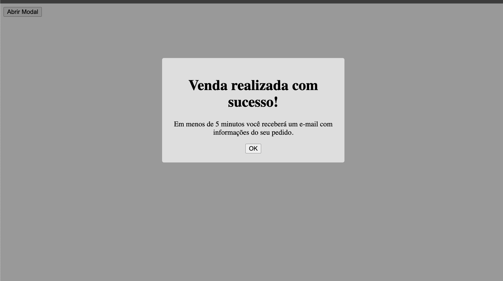

# Sobre a Tag `<transition>`

A tag `<transition>` no Vue.js permite adicionar animações ou transições suaves em elementos que entram ou saem do DOM. O Vue automaticamente adiciona classes CSS durante essas transições, facilitando a aplicação de efeitos visuais. Podemos personalizar essas classes ou utilizar animações CSS pré-definidas.

---

# Falando sobre o Código e Pontos Importantes

## Exemplo de Uso: Transição Fade

Neste exemplo, aplicamos um efeito de fade ao `<h1>` quando ele é exibido ou removido da tela:

```vue
<template>
  <div id="app">
    <button @click="active = !active">Ativar</button>
    <transition name="fade">
      <h1 v-if="active">Serviços</h1>
    </transition>
  </div>
</template>

<script>
export default {
  name: "App",
  data() {
    return {
      active: false,
    };
  }
};
</script>

<style>
  .fade-enter-active, .fade-leave-active {
    transition: opacity 0.3s;
  }
  .fade-enter, .fade-leave-to {
    opacity: 0;
  }
</style>
```

### Explicação das Classes Automáticas do Vue:

- `.fade-enter` → Aplica-se no momento em que o elemento entra.
- `.fade-enter-active` → Define a animação da entrada.
- `.fade-enter-to` → Aplica-se quando a transição de entrada termina.
- `.fade-leave` → Aplica-se no momento em que o elemento começa a sair.
- `.fade-leave-active` → Define a animação de saída.
- `.fade-leave-to` → Aplica-se quando a transição de saída termina.

## Exemplo de Uso: Transição Slide

Podemos criar um efeito de deslize quando um elemento entra e sai:

```vue
<template>
  <div id="app">
    <button @click="active = !active">Ativar</button>
    <transition name="slide">
      <h1 v-if="active">Serviços</h1>
    </transition>
  </div>
</template>

<style>
  .slide-enter-active, .slide-leave-active {
    transition: transform 0.5s ease-out;
  }
  .slide-enter {
    transform: translateX(-100%);
  }
  .slide-enter-to {
    transform: translateX(0);
  }
  .slide-leave {
    transform: translateX(0);
  }
  .slide-leave-to {
    transform: translateX(100%);
  }
</style>
```

## Exemplo de Uso: Customizando Classes

Podemos substituir as classes padrão do Vue e definir manualmente as classes de entrada e saída:

```vue
<template>
  <div id="app">
    <button @click="active = !active">Ativar</button>
    <transition 
      enter-active-class="animar"
      leave-active-class="sumir"
    >
      <h1 v-if="active">Serviços</h1>
    </transition>
  </div>
</template>

<style>
  .animar {
    animation: fadeIn 0.5s;
  }
  .sumir {
    animation: fadeOut 0.5s;
  }
  @keyframes fadeIn {
    from { opacity: 0; }
    to { opacity: 1; }
  }
  @keyframes fadeOut {
    from { opacity: 1; }
    to { opacity: 0; }
  }
</style>
```

---

# Quando Usar e Quando Não Usar

## Quando Usar

✅ Melhorar a experiência do usuário com transições suaves.
✅ Modais, dropdowns e tooltips.
✅ Quando elementos entram ou saem do DOM e precisam de um efeito visual.

## Quando Não Usar

❌ Animações muito complexas que podem ser melhor gerenciadas com bibliotecas como GSAP.
❌ Quando o desempenho for uma prioridade e animações possam causar lentidão.
❌ Para transições entre páginas em aplicações grandes (neste caso, o `<transition>` não é ideal, sendo melhor usar Vue Router Transitions).

---

# Conclusão

A tag `<transition>` do Vue.js facilita a criação de efeitos visuais suaves para elementos dinâmicos. Com ela, podemos aplicar diferentes tipos de animações, como fade, slide e personalizações avançadas. No entanto, é importante usá-la estrategicamente para evitar impactos negativos na performance da aplicação.

---

### Exemplo de Modal em Vue.js

Neste exemplo, criamos um modal utilizando o Vue.js, onde o componente pai (`App.vue`) gerencia a visibilidade do modal e o componente filho (`VueCliModal.vue`) é responsável pela exibição do modal. Utilizamos transições para adicionar um efeito de entrada e saída suave.

---

#### 1. **Componente Pai: `App.vue`**

O componente pai contém um botão que, ao ser clicado, altera o estado de `active` para mostrar ou esconder o modal. A transição é aplicada ao modal quando ele entra ou sai da tela.

```vue
<template>
  <div id="app">
    <button @click="clicked">Abrir Modal</button>
    <transition name="modal">
      <VueCliModal :hasActive="clicked" v-if="active" />
    </transition>
  </div>
</template>

<script>
export default {
  name: "App",
  data() {
    return {
      active: false, // Controle do estado do modal
    };
  },
  components: {
    VueCliModal: () => import("./components/VueCliModal.vue"), // Importação do componente filho
  },
  methods: {
    clicked() {
      this.active = !this.active; // Alterna a visibilidade do modal
    },
  },
};
</script>

<style scoped>
* {
  box-sizing: border-box;
}

/* Estilo para a transição de opacidade */
.modal-enter,
.modal-leave-to {
  opacity: 0;
}

.modal-enter-active,
.modal-leave-to {
  transition: opacity 0.3s;
}
</style>
```

**Explicação:**
- **Botão de Abertura**: O botão dispara o método `clicked()`, que alterna o valor de `active`.
- **Transição**: A transição `modal` é aplicada quando o modal entra ou sai da tela, criando um efeito de desvanecimento.
- **Condição `v-if`**: O modal será renderizado apenas quando a variável `active` for `true`.

---

#### 2. **Componente Filho: `VueCliModal.vue`**

Este componente representa o modal real que será exibido ou escondido. Ele será passado como um `prop` do componente pai.

```vue
<template>
  <div v-if="hasActive" class="modal">
    <div class="modal-content">
      <slot></slot> <!-- Conteúdo do Modal -->
    </div>
  </div>
</template>

<script>
export default {
  name: "VueCliModal",
  props: {
    hasActive: {
      type: Boolean,
      required: true, // Controla a visibilidade do modal
    },
  },
};
</script>

<style scoped>
.modal {
  position: fixed;
  top: 0;
  left: 0;
  right: 0;
  bottom: 0;
  background-color: rgba(0, 0, 0, 0.5);
  display: flex;
  justify-content: center;
  align-items: center;
}

.modal-content {
  background-color: white;
  padding: 20px;
  border-radius: 8px;
  width: 300px;
}
</style>
```

**Explicação:**
- **Propriedade `hasActive`**: Este `prop` recebe o valor de `clicked()` do componente pai, controlando a visibilidade do modal.
- **Conteúdo**: O modal pode ser preenchido com qualquer conteúdo passado entre as tags `<VueCliModal></VueCliModal>` no componente pai, utilizando a diretiva `slot`.
- **Estilos**: A estilização faz o modal ocupar toda a tela com fundo semitransparente e centraliza o conteúdo em uma caixa branca.

---

### Conclusão

Este exemplo demonstra como criar um modal simples utilizando Vue.js, onde o componente pai controla a exibição do componente filho (`VueCliModal`). O uso de transições ajuda a criar um efeito visual suave para a entrada e saída do modal.

### Evidencia do Modal:

